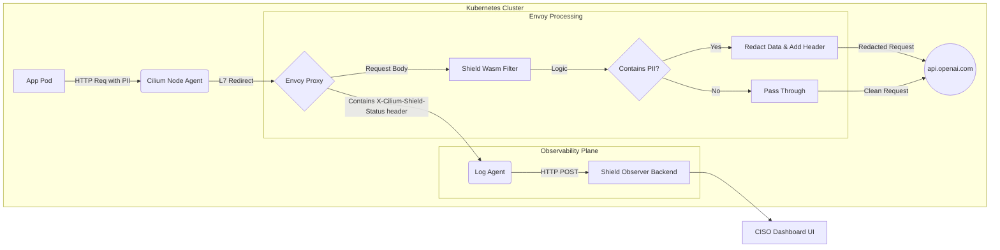

### 2. Teknik Derinlik Dosyası: `ARCHITECTURE.md`
*Bu dosya senin "Senior Engineer" olduğunu kanıtlayan yerdir. Jürideki teknik kişiler (Liz Rice vb.) buraya bayılır.*

# 🏗️ System Architecture

## Overview
Cilium-Shield leverages the **CiliumEnvoyConfig CRD** to inject a custom **WebAssembly (Wasm)** filter into the Envoy proxy running on each node. This allows us to perform Layer 7 inspection on outbound traffic in a sidecar-free service mesh, without modifying the application code.

## High-Level Diagram

## Core Components
1.  **The Wasm Filter (Data Plane)**
    *   **Language:** Written in **TinyGo** using the `proxy-wasm-go-sdk`.
    *   **Function:** Hooks into the `OnHttpRequestBody` phase to inspect the entire JSON payload. It does not block the request but redacts data in-flight.
    *   **Performance:** By running inside Envoy's Wasm sandbox, it incurs negligible latency (<1ms) and is memory-safe. This is far more efficient than a traditional sidecar proxy.
    *   **Detection Logic:** Uses a combination of high-performance Regex and the **Luhn Algorithm** to accurately detect and redact sensitive data like Credit Card Numbers and API Keys.
    *   **Logging Trigger:** If a redaction occurs, the filter adds a custom header `X-Cilium-Shield-Status: REDACTED` to the request. This serves as a trigger for the observability plane.

2.  **Cilium Integration**
    *   We use the `CiliumClusterwideEnvoyConfig` Custom Resource Definition (CRD).
    *   This CRD instructs Cilium to locate the listener for outbound traffic (e.g., to `api.openai.com`) and inject our Wasm module into the filter chain for all pods.

3.  **The Observer (Control Plane)**
    *   **Stack:** **Golang + In-Memory Store** (for the hackathon MVP).
    *   **Role:** The `Shield Observer` is a simple Go backend that exposes an HTTP endpoint (`/api/v1/events`).
    *   **Data Ingestion:** It receives "Leak Events" from an external log agent (like Fluentd, Vector, or a custom script) that is configured to watch the Envoy access logs. When the agent sees a request with the `X-Cilium-Shield-Status` header, it forwards the relevant details to the Observer. This decouples the Wasm filter from the logging process, ensuring the filter's primary job remains fast and efficient.
    *   **Concurrency:** The observer uses **Goroutines** to handle high-volume event ingestion without blocking.

## Design Decisions: Why Wasm + Cilium?
*   **Why not a Sidecar?** Running a full sidecar proxy for every pod consumes significant memory and CPU resources. Cilium's per-node proxy model with Wasm provides the same functionality with a much smaller footprint.
*   **Why not pure eBPF?** While eBPF is unparalleled for L3/L4 filtering, parsing complex JSON payloads and performing regex in kernel space is complex, brittle, and constrained by the eBPF verifier. By using eBPF for L7 redirection and Wasm for L7 parsing, we get the best of both worlds: kernel-level performance and user-space flexibility.